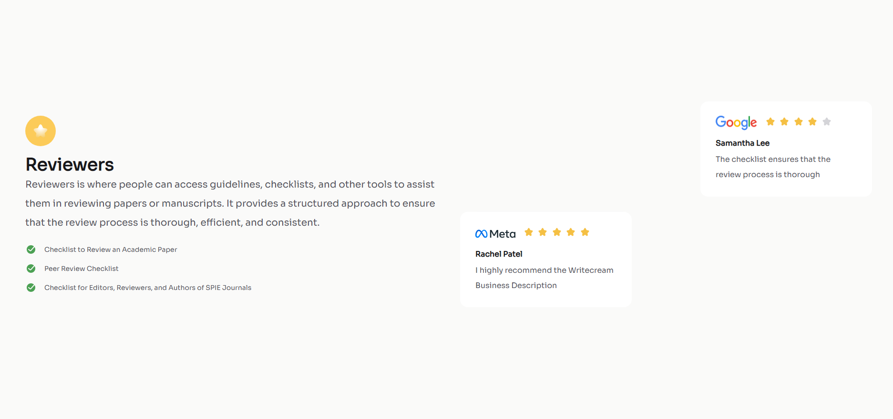

<h1 align="center">Testimonial-page | devChallenges</h1>

   Solution for a challenge <a href="https://devchallenges.io/challenge/testimonial-page" target="_blank">Testimonial Page</a> from <a href="http://devchallenges.io" target="_blank">devChallenges.io</a>.

  <h3>
    <a href="https://testimonial-page-blush.vercel.app/">
      Demo
    </a>
     | 
    <a href="https://devchallenges.io/solution/45792">
      Solution
    </a>
     | 
    <a href="https://devchallenges.io/challenge/testimonial-page">
      Challenge
    </a>
  </h3>

<!-- TABLE OF CONTENTS -->

## Table of Contents

- [Overview](#overview)
  - [What I learned](#what-i-learned)
  - [Useful resources](#useful-resources)
- [Built with](#built-with)
- [Features](#features)
- [Contact](#contact)
- [Acknowledgements](#acknowledgements)

<!-- OVERVIEW -->

## Overview

### What I learned

flexible design

### Useful resources

[align-self - CSS: カスケーディングスタイルシート | MDN](https://developer.mozilla.org/ja/docs/Web/CSS/align-self)

[【CSS】line-heightで行間を調整する方法：おすすめの値は？](https://saruwakakun.com/html-css/reference/line-height)

### Built with

- Semantic HTML5 markup
- CSS custom properties
- Flexbox
- CSS Grid

## Features

This application/site was created as a submission to a [DevChallenges](https://devchallenges.io/challenges-dashboard) challenge.

## Acknowledgements

[VSCode Live Preview](https://marketplace.visualstudio.com/items?itemName=searKing.preview-vscode)

## Author

- GitHub [mi8bi](https://github.com/mi8bi)
